# AWS 기반 웹 서비스 인프라 구축

서울 리전에서 VPC와 Public Subnet을 만들고 EC2에 Nginx를 설치하여 외부 브라우저 접속을 확인한 실습입니다. 네트워크 구성, 접근 제어, HTTP 응답, Nginx 장애 진단과 재시작, 리소스 정리 결과를 실제 스크린샷에 연결했습니다.

실습 기록일은 **2026년 10월 5일(KST)**입니다. 아래 구성과 주소는 실습 당시 기록이며 정리 이후의 운영 서비스 주소가 아닙니다. EC2 정리 화면은 `종료 중`까지 확인됩니다. IAM의 작업 목록은 사용자 제공 내용으로 보완했으며 대상 리소스와 조건 범위는 추가 확인이 필요합니다.

- 구성 내용을 확인할 때: [프로젝트 구성 설명](docs/project-explanation.md)
- 전체 사진을 순서대로 볼 때: [증거 사진 목록](docs/evidence-index.md)
- IAM 권한: [작업별 권한 설명과 원문](docs/iam-permissions.md)
- 운영 기록: [트러블슈팅 보고서](docs/troubleshooting.md), [리소스 정리 체크리스트](docs/cleanup-checklist.md)

## 1. 프로젝트 소개와 실제 구성

인터넷에서 접근할 수 있는 웹 서버를 직접 구성하고 요청이 서버까지 도달하기 위해 필요한 네트워크 경로와 보안 설정을 검증했습니다. 웹 페이지는 EC2의 Nginx가 제공합니다. 저장소의 `main.py`는 `hello world` 출력 예제이며 이번 웹 서비스의 실행 프로그램은 아닙니다.

| 항목 | 스크린샷에서 확인한 값 |
| --- | --- |
| 실습 일자 / 리전 | 2026-10-05 KST / 서울 `ap-northeast-2` |
| IAM 사용자 / 연결 정책 | `aws-mission-IAM` / 인라인 정책 `aws-mission-policy` |
| VPC | `aws-mission-vpc` / `vpc-0d72ca45b221845d4` / `10.0.0.0/16` |
| Public Subnet | `aws-mission-subnet` / `subnet-0df38aa7d67f673c6` / `10.0.1.0/24` |
| 가용 영역 | `ap-northeast-2a` |
| Internet Gateway | `aws-mission-igw` / `igw-0b7e6690e130b4b51` |
| Route Table | `aws-mission-rt` / `rtb-0bebab9858be85feb` |
| EC2 | `aws-mission-ec2` / `i-054eeabf8b19481d9` / `t3.micro` |
| OS / AMI | Ubuntu 26.04 LTS / `ami-0bc151a94289adb52` |
| 스토리지 생성 설정 | EBS `gp3`, `8 GiB`, 종료 시 삭제 설정. 실제 볼륨 ID는 화면에 없음 |
| 웹 서버 | Nginx `1.28.3` — HTTP 응답 헤더 기준 |
| 키페어 | `aws-mission-key` — 개인키는 제출 대상에서 제외 |
| 실습 당시 공인 / 사설 IPv4 | `3.36.126.94` / `10.0.1.106` |
| Security Group | `aws-mission-sg` / `sg-04bf96b2f2a29e49a` |
| 외부 검증 방식 | 로컬 Chrome에서 `http://3.36.126.94` 접속 |

## 2. 아키텍처

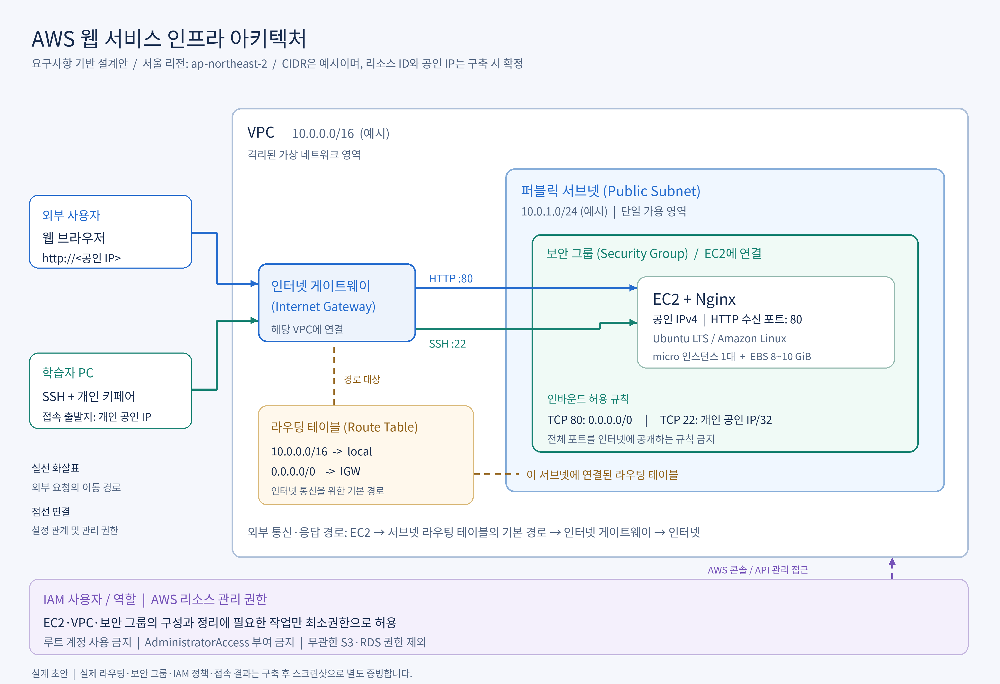

그림 파일: [PNG](docs/architecture.png) · [수정 가능한 SVG](docs/architecture.svg)

| 구성 요소 | 이 실습에서 맡은 역할 |
| --- | --- |
| VPC | 서비스에 사용할 가상 네트워크 범위 `10.0.0.0/16` |
| Public Subnet | EC2가 배치된 `10.0.1.0/24` 대역. 연결한 Route Table에 IGW 기본 경로가 있음 |
| Route Table | VPC 내부 통신은 `local`, 인터넷 목적지는 `0.0.0.0/0 → IGW`로 전달 |
| Internet Gateway | VPC에 연결되어 EC2의 공인 IPv4를 통한 인터넷 통신을 지원 |
| Security Group | EC2에 연결된 방화벽 규칙. HTTP 80과 제한된 SSH 22 접근 허용 |
| EC2 + Nginx | HTTP 요청을 처리하고 기본 웹 페이지 및 정적 `/health` 파일 제공 |
| IAM 사용자 | AWS 콘솔에서 리소스를 구성하는 관리 주체. 웹 요청 경로와 별개 |

외부 사용자는 EC2의 공인 IPv4로 HTTP 요청을 보냅니다. 요청은 Internet Gateway를 거쳐 EC2에 도달하며, 연결된 Security Group이 TCP 80을 허용하면 Nginx가 응답합니다. 응답과 인터넷 아웃바운드 통신에는 Subnet에 연결한 Route Table의 IGW 경로가 사용됩니다.

관리자는 개인키를 이용해 SSH 22로 접속합니다. 이 경로는 촬영 당시 개인 공인 IPv4 한 개(`/32`)만 허용했습니다. 그림의 점선은 Route Table 연결 관계와 IAM 관리 관계를 표시합니다.

## 3. 요구사항별 구현과 증빙

### 3.1. 네트워크 구성

VPC와 Subnet을 생성하고 Internet Gateway를 해당 VPC에 연결했습니다. 이후 사용자 Route Table에 기본 경로를 추가하고 실습 Subnet을 명시적으로 연결했습니다.

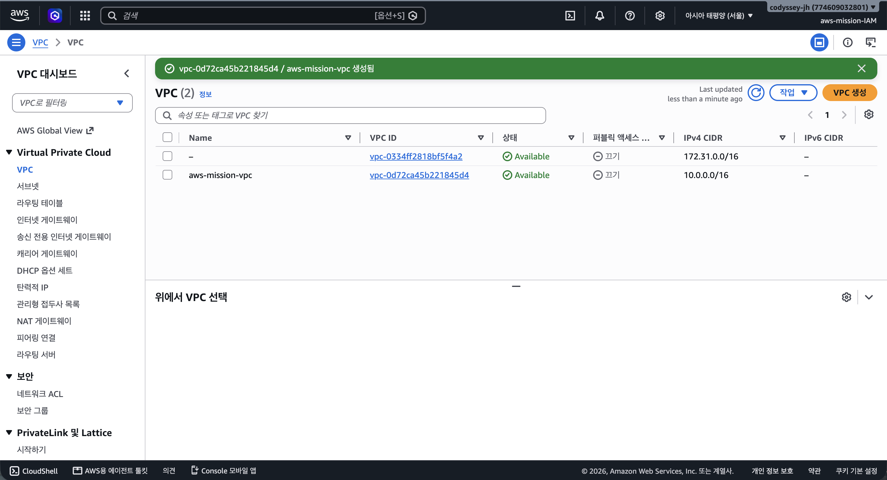

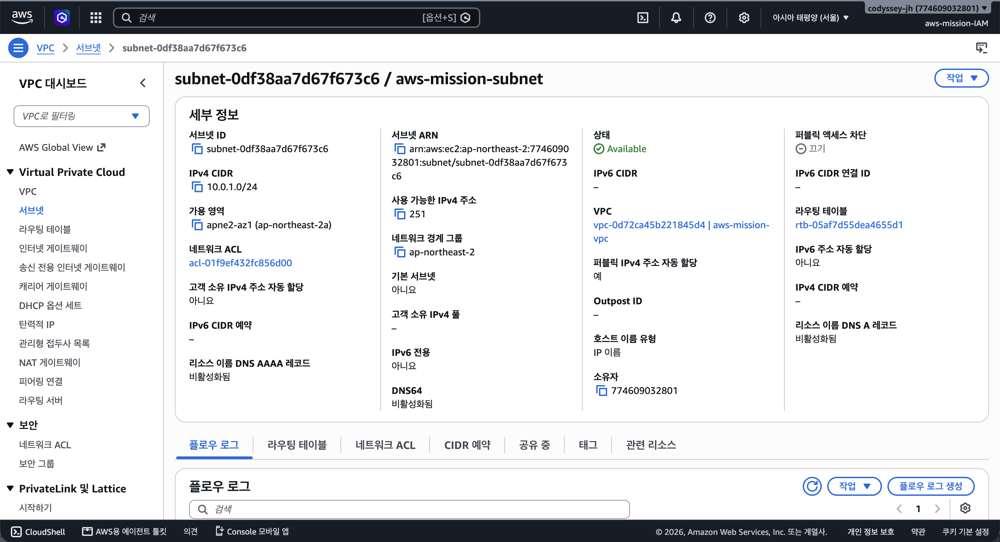

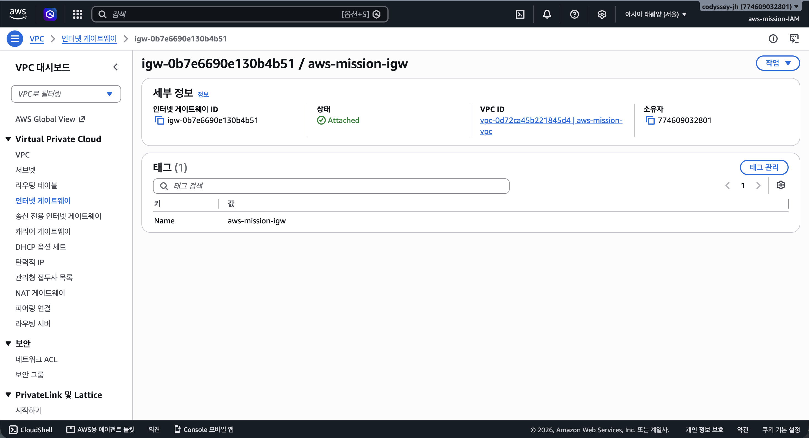

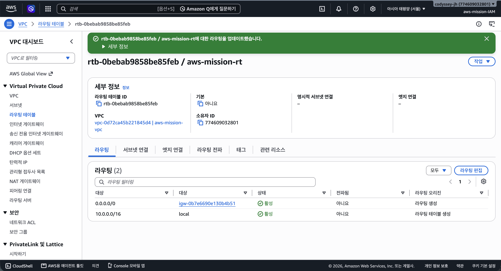

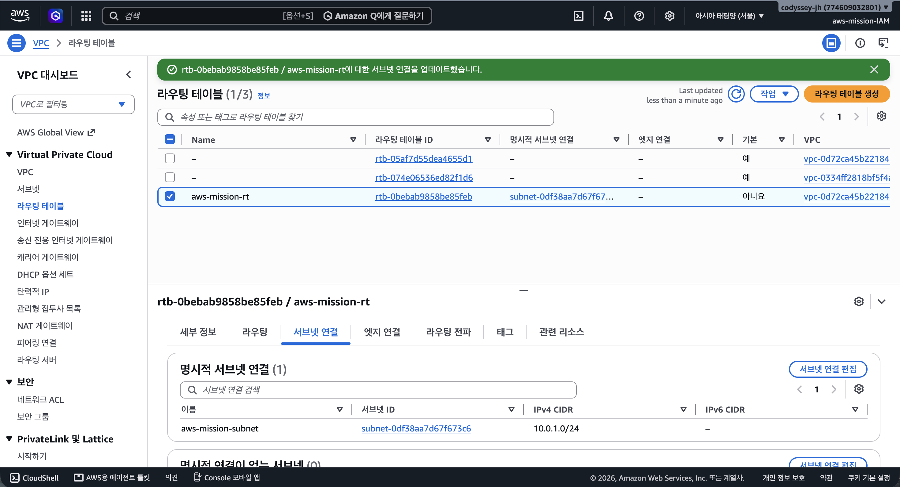

Subnet 상세 화면은 생성 직후 기본 Route Table을 보여줍니다. 최종 라우팅 연결은 마지막 화면의 `aws-mission-rt`와 실습 Subnet의 연결을 기준으로 확인했습니다.

EC2 터미널에서 외부 HTTPS 요청의 `HTTP/2 200`도 확인했습니다. 응답 헤더의 시각은 **17:33:39 KST**입니다.

```bash
curl -I --max-time 15 https://example.com
```

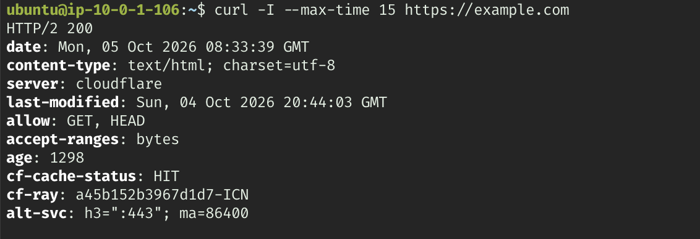

### 3.2. EC2와 Nginx 배포

EC2를 실습 VPC와 Subnet에 배치하고 공인 IPv4를 할당했습니다. OS는 Ubuntu 26.04 LTS, 유형은 `t3.micro`이며 EBS 생성 설정은 `gp3` 8 GiB입니다.

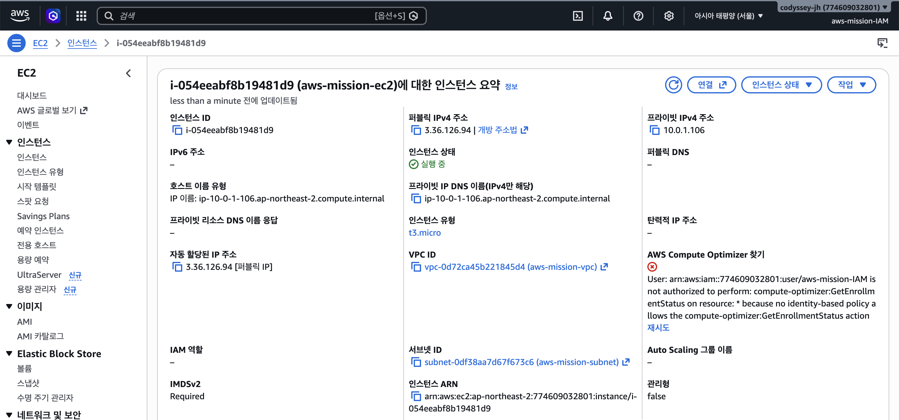

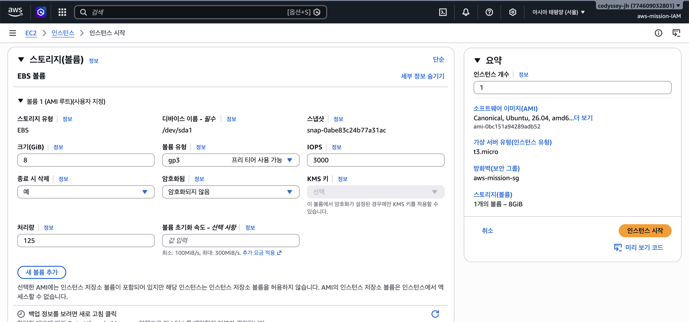

로컬 PC에서 개인키 권한을 제한한 뒤 Ubuntu 사용자로 SSH 접속했습니다.

```bash
chmod 400 <키파일.pem>
ssh -i <키파일.pem> ubuntu@<실습 당시 공인IPv4>
```

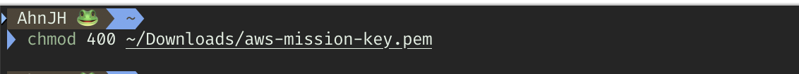

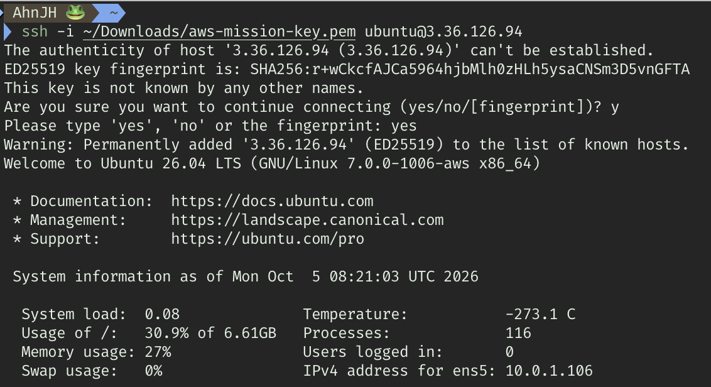

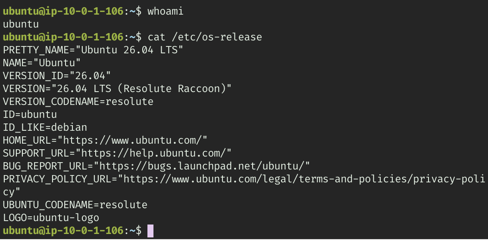

EC2에 Nginx를 설치하고 실행 상태와 내부 HTTP 응답을 확인했습니다.

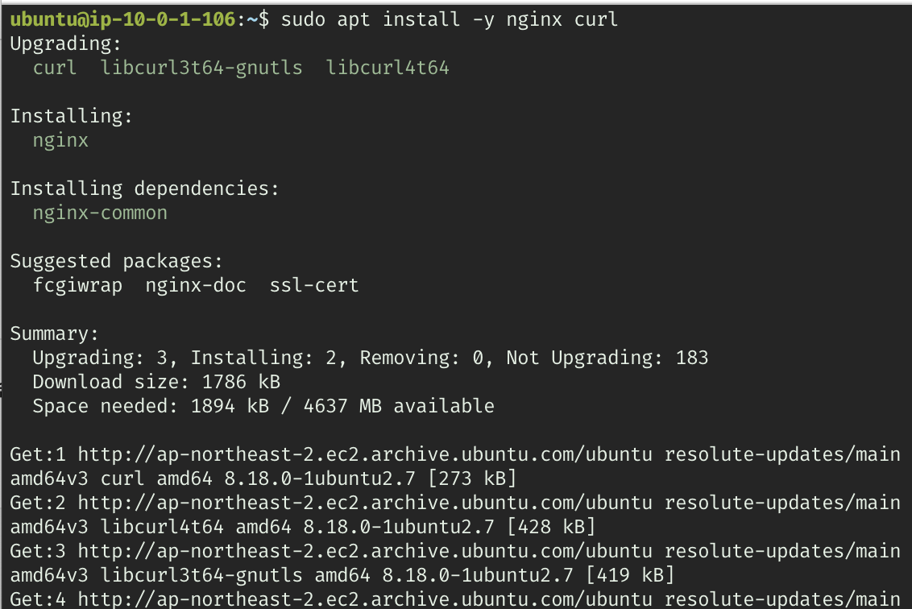

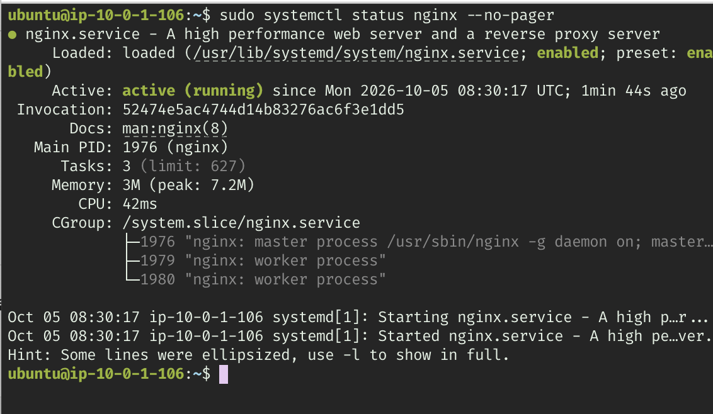

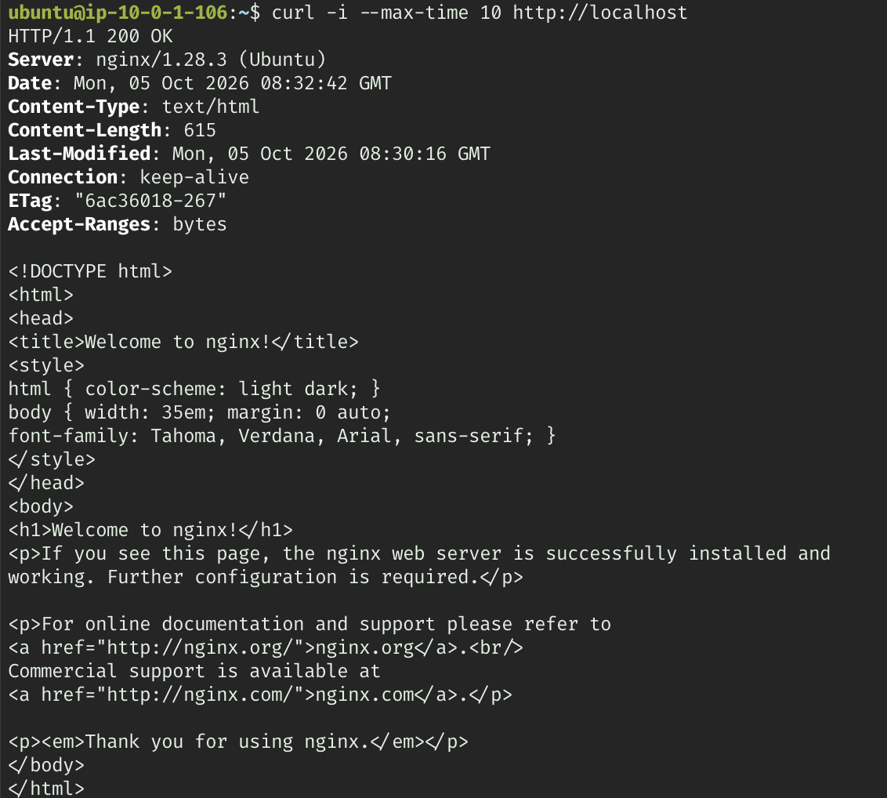

`localhost` 응답 헤더의 시각은 **17:32:42 KST**입니다. 서버 내부의 웹 서버 실행과 응답을 확인한 증거이며 외부 접근은 3.5절의 브라우저 화면으로 별도 확인했습니다.

### 3.3. Security Group 접근 제어

| 방향 | 프로토콜 / 포트 | 허용 대상 | 용도 |
| --- | --- | --- | --- |
| 인바운드 | TCP 80 | `0.0.0.0/0` | 외부 웹 접속 |
| 인바운드 | TCP 22 | 촬영 당시 개인 공인 IPv4 `/32` | 관리자 SSH 접속 |
| 아웃바운드 | 모든 트래픽 | `0.0.0.0/0` | 패키지 설치 및 외부 통신 |

EC2 보안 탭에서 `aws-mission-sg`가 실제 연결되었고 위 규칙이 적용되었음을 확인했습니다. 표시된 인바운드 규칙은 HTTP와 SSH 두 개입니다.

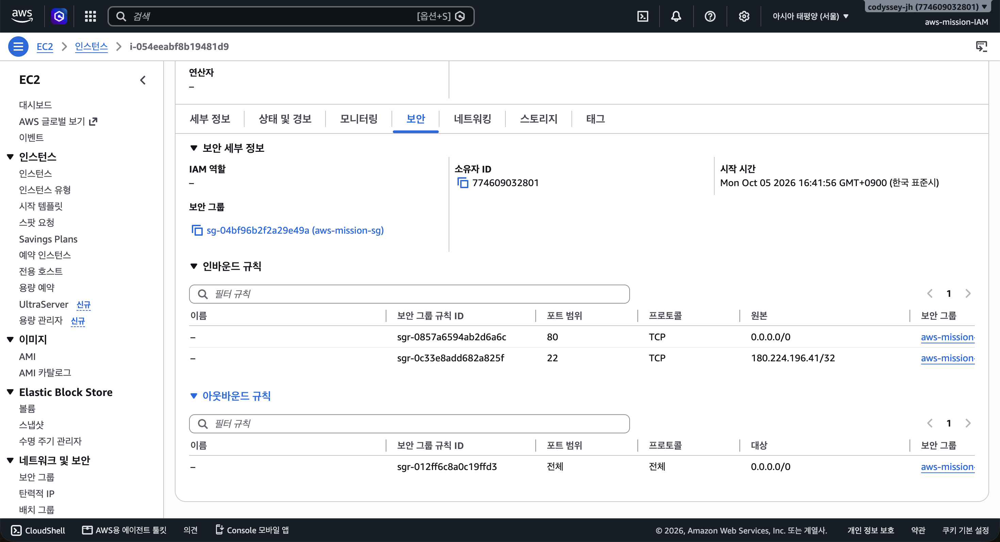

생성 및 편집 과정은 [인바운드 설정](docs/screenshots/sg/sg_setting_inbound.png), [아웃바운드 설정](docs/screenshots/sg/sg_setting_outbound.png)에 있습니다. 최종 적용 여부는 위 EC2 보안 탭 화면을 근거로 삼았습니다.

### 3.4. IAM 사용자와 관리 권한

별도 IAM 사용자 `aws-mission-IAM`을 생성하고 해당 사용자로 콘솔에 접속했습니다. 사용자에게 인라인 정책 `aws-mission-policy` 한 개가 연결되어 있습니다.

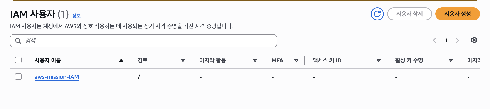

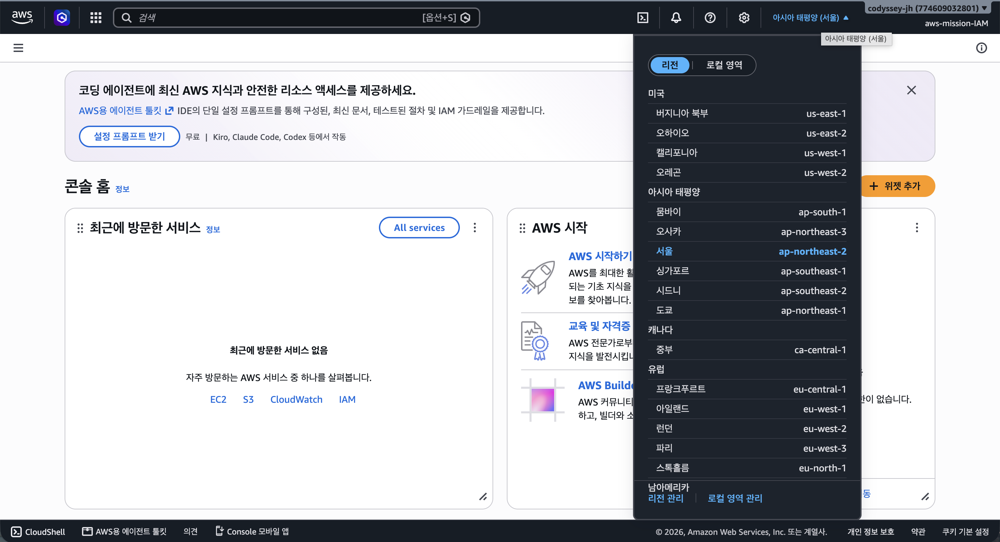

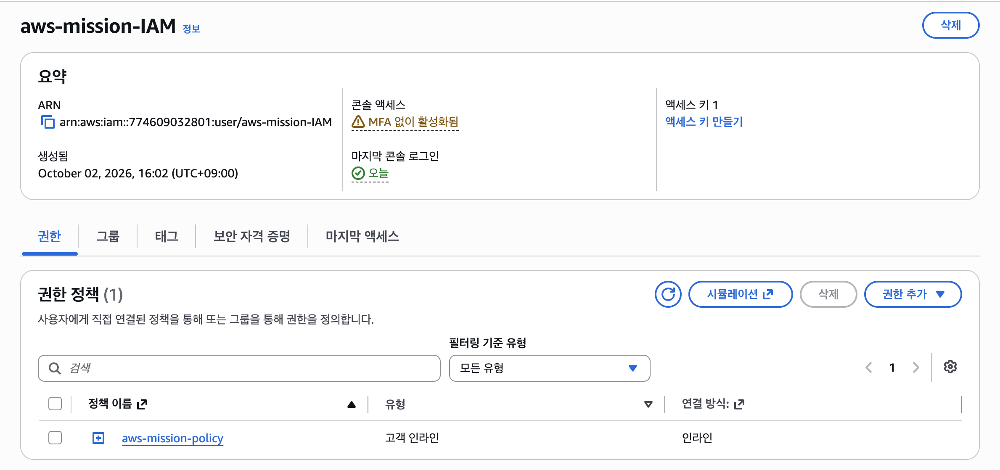

정책에 사용한 **36개 `Action` 항목**은 사용자가 제공한 목록으로 기록했습니다. 전체 목록과 작업별 설명은 [IAM 권한 문서](docs/iam-permissions.md), 원문을 보존한 JSON 조각은 [iam-actions.json](docs/iam-actions.json)에 있습니다. 위 사진은 정책 연결의 증거이며, 작업 목록의 출처는 사용자 제공 내용입니다.

| 권한 분류 | 포함된 작업 | 실습 용도 |
| --- | --- | --- |
| 조회 | `ec2:Describe*`, `ec2:GetSecurityGroupsForVpc` | EC2·네트워크 상태 및 VPC의 보안 그룹 조회 |
| 네트워크 구성 | VPC·Subnet 생성, 속성 변경, 삭제 / IGW 생성·연결·분리·삭제 | 서비스 네트워크 구축과 정리 |
| 라우팅 | Route Table 생성·연결·연결 해제·삭제 / Route 생성·교체·삭제 | 인터넷 기본 경로 설정과 정리 |
| 보안 그룹 | 그룹 생성·삭제, 인바운드·아웃바운드 규칙 추가·제거·수정 | HTTP·SSH 접근 규칙 관리 |
| EC2·키페어 | 키페어 생성·삭제, 인스턴스 생성·시작·중지·재부팅·종료 | SSH 준비와 서버 수명주기 관리 |
| EBS·태그 | 볼륨 삭제, 태그 생성·삭제 | 실습 스토리지와 리소스 이름·표식 정리 |

`ec2:Describe*`는 이름이 `Describe`로 시작하는 EC2 작업을 포함하는 와일드카드입니다. 제공한 목록은 모두 `ec2:` 작업이지만 실제 정책의 `Effect`, `Resource`, 선택 항목인 `Condition`은 아직 제공되지 않았습니다. 따라서 대상 리소스·리전·태그 제한과 다른 정책을 통한 권한까지는 추가 확인해야 합니다. 전체 최소권한 검증은 해당 범위를 확인한 뒤 판단할 수 있습니다. [AWS Action 문서](https://docs.aws.amazon.com/IAM/latest/UserGuide/reference_policies_elements_action.html), [AWS Condition 문서](https://docs.aws.amazon.com/IAM/latest/UserGuide/reference_policies_elements_condition.html)

Security Group은 서버에 도달하는 트래픽을 제어하고 IAM은 AWS 리소스를 관리하는 주체의 권한을 제어합니다. EC2 보안 탭에는 IAM Role이 연결되지 않은 것으로 표시됩니다.

### 3.5. 외부 접속과 health 응답 검증

**외부 검증은 A 방식인 브라우저 접속으로 확인했습니다.** 로컬 Chrome에서 `http://3.36.126.94`로 접속했을 때 Nginx 기본 페이지가 표시됩니다. 브라우저 사진에는 정확한 촬영 시각이 표시되지 않습니다.

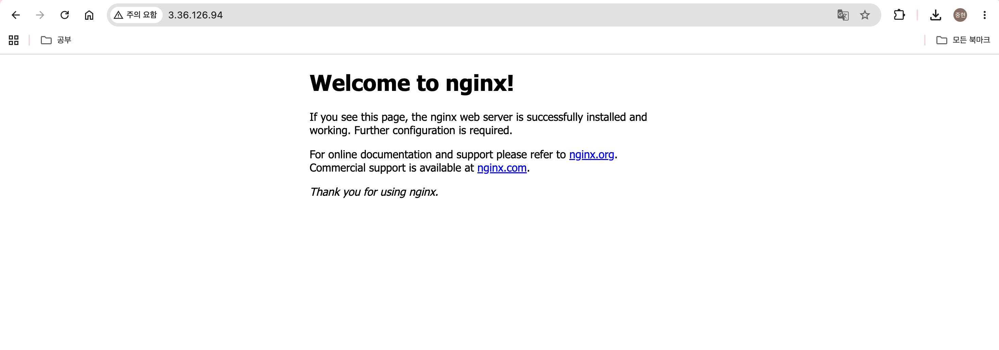

추가로 EC2 내부에서 `/health`의 `200 OK`와 본문 `OK`를 확인했습니다. `/health`는 `/var/www/html/health`에 만든 정적 파일이며 애플리케이션이나 데이터베이스의 상태를 검사하지는 않습니다.


| 검증 | 위치 | 확인 결과 / 응답 헤더의 시각 |
| --- | --- | --- |
| 기본 페이지 | 외부 PC Chrome | Nginx 기본 페이지 표시 / 사진에 시각 없음 |
| `http://localhost/health` | EC2 터미널 | HTTP 200, `OK` / 17:35:16 KST |
| `http://3.36.126.94/health` | EC2 터미널 | HTTP 200, `OK` / 17:36:20 KST |

공인 IP를 호출한 터미널의 프롬프트도 EC2이므로 이 화면을 외부 PC의 curl 검증으로 분류하지 않았습니다. [브라우저에서 다운로드한 health 파일 화면](docs/screenshots/ssh-install_nginx_connect/web-connect-%3Ahealth-ok_check.png)은 본문 `OK`의 보조 자료입니다.

### 3.6. 리소스 정리와 비용 확인

상세 상태와 각 삭제 증거는 [리소스 정리 체크리스트](docs/cleanup-checklist.md)에 연결했습니다.

| 대상 | 사진으로 확인한 상태 |
| --- | --- |
| EC2 | 종료 요청 처리 및 `종료 중` 상태. 최종 `terminated` 화면은 없음 |
| EBS | 서울 리전 볼륨 목록에서 볼륨 없음 |
| Internet Gateway / Route Table / Subnet / VPC | 각 실습 리소스 삭제 성공 메시지 |
| Security Group | 삭제 후 목록에 실습 SG가 없고 default SG만 남음 |
| Elastic IP 및 기타 추가 리소스 | 해당 목록 증거가 없어 생성·정리 여부 추가 확인 필요 |


2026년 10월 예상 청구서는 **2026-10-05 18:24:18 KST** 갱신 기준 `USD 0.00`으로 표시됩니다. 크레딧 화면은 총 잔액 `US$120.00`을 보여줍니다. 집계 시점의 표시값으로 기록하며 각 리소스의 정리 상태는 위 삭제 증거를 기준으로 판단했습니다.

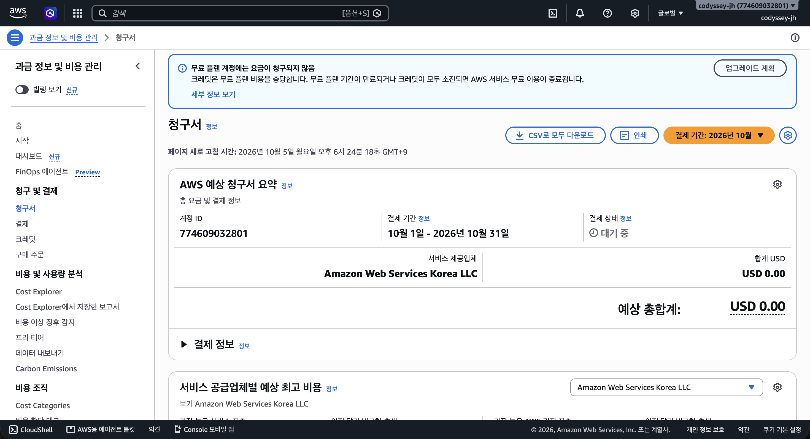

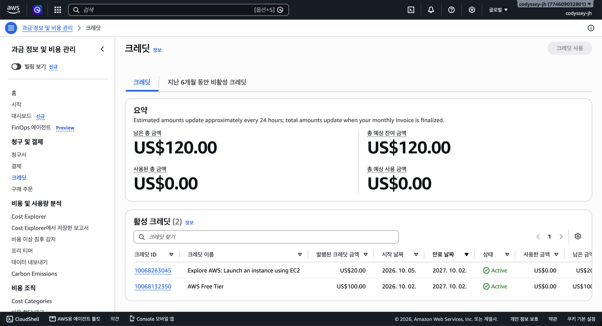

두 Billing 파일은 이름과 실제 화면 내용이 서로 바뀌어 있어 위 설명은 화면 내용을 기준으로 작성했습니다.

## 4. 트러블슈팅

Nginx가 정지된 상황에서 HTTP 연결 실패를 확인하고 서비스 상태와 로그로 원인을 좁혔습니다. EC2에서 공인 주소와 `localhost` 요청이 함께 실패했고 Nginx는 `inactive (dead)`였습니다. 서비스를 다시 시작한 뒤 `active (running)`을 확인했습니다.

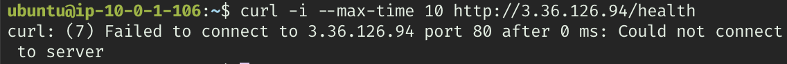

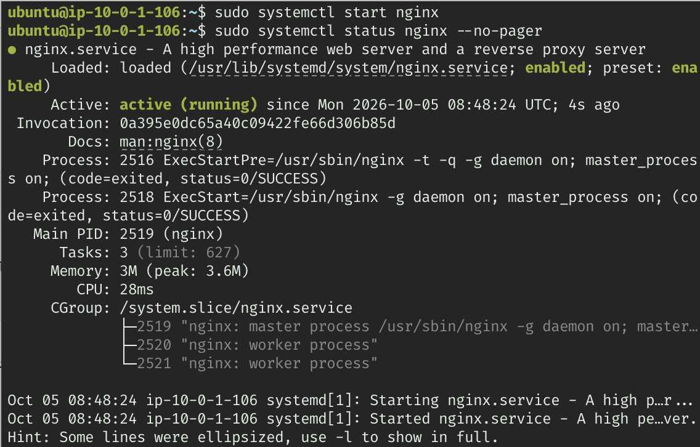

정지 로그의 시각은 **17:45:01 KST**, 재시작 시각은 **17:48:24 KST**입니다. 정지시킨 주체와 의도는 캡처만으로 확인되지 않습니다. 재시작 직후의 HTTP 재검증 화면도 없어 서비스 실행 상태의 복구까지 기록했습니다. 증상 → 가설 → 검증 → 조치 → 결과 → 재발 방지는 [트러블슈팅 보고서](docs/troubleshooting.md)에 정리했습니다.

## 5. 문서와 증거 파일

| 경로 | 내용 |
| --- | --- |
| [README.md](README.md) | 실제 구성과 요구사항별 핵심 증빙 |
| [docs/architecture.png](docs/architecture.png) | 실제 구성을 반영한 아키텍처 그림 |
| [docs/architecture.svg](docs/architecture.svg) | 확대 및 수정 가능한 아키텍처 원본 |
| [docs/project-explanation.md](docs/project-explanation.md) | 구성 요소와 핵심 증거 설명 |
| [docs/iam-permissions.md](docs/iam-permissions.md) | 사용자 제공 IAM Action 목록과 작업별 역할 |
| [docs/iam-actions.json](docs/iam-actions.json) | 제공된 36개 Action 항목을 보존한 JSON 조각 |
| [docs/evidence-index.md](docs/evidence-index.md) | 전체 53개 스크린샷의 단계별 링크와 의미 |
| [docs/troubleshooting.md](docs/troubleshooting.md) | Nginx 정지 원인 확인과 재시작 기록 |
| [docs/cleanup-checklist.md](docs/cleanup-checklist.md) | 리소스별 정리 상태와 근거 |
| `docs/screenshots/` | 원본 증거 사진 |

## 6. 증빙 확인 결과

- [x] 서울 리전의 VPC, Public Subnet, EC2 구성 확인
- [x] Internet Gateway 연결, 기본 경로, 최종 Subnet 연결 확인
- [x] SSH 접속, Nginx 실행, 내부 HTTP 200, 외부 HTTPS 응답 확인
- [x] HTTP 80 전체 공개 및 SSH 22 개인 IP 제한의 최종 적용 확인
- [x] 별도 IAM 사용자 로그인 및 인라인 정책 연결 확인
- [x] 사용자 제공 IAM Action 목록과 작업별 용도 기록
- [x] 외부 브라우저의 Nginx 접속 성공 확인
- [x] 실제 파일 경로로 증빙 연결 및 아키텍처·설명 문서 작성
- [x] Nginx 장애 상태, 로그, 재시작 기록
- [x] EBS 목록과 네트워크 리소스 삭제 증거 기록
- [ ] IAM 정책의 Effect·Resource·Condition 및 다른 권한 경로로 전체 범위 확인
- [ ] EC2의 최종 `terminated` 상태 추가 확인
- [ ] 장애 재시작 직후 HTTP 응답 재검증 증거 확인
- [ ] Elastic IP 및 기타 추가 리소스의 미생성 또는 정리 상태 추가 확인
