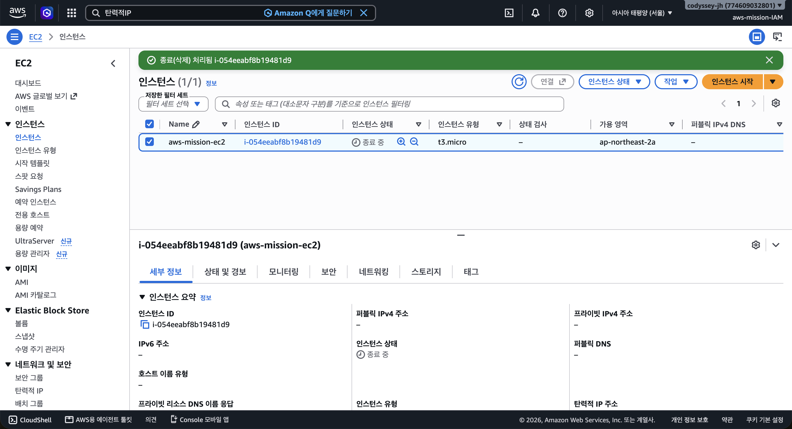
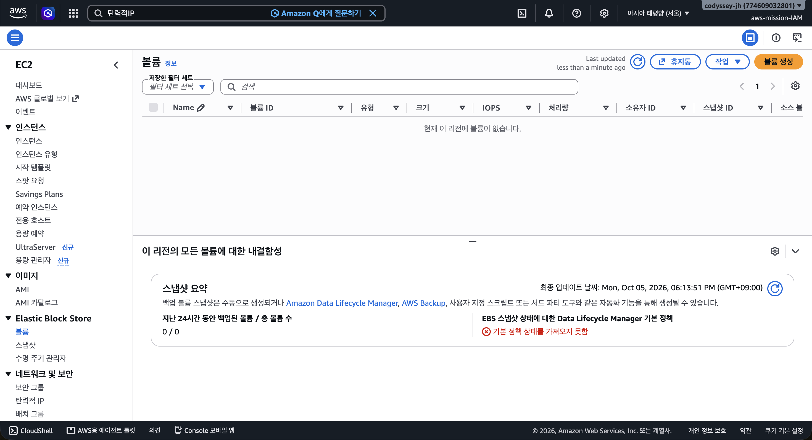
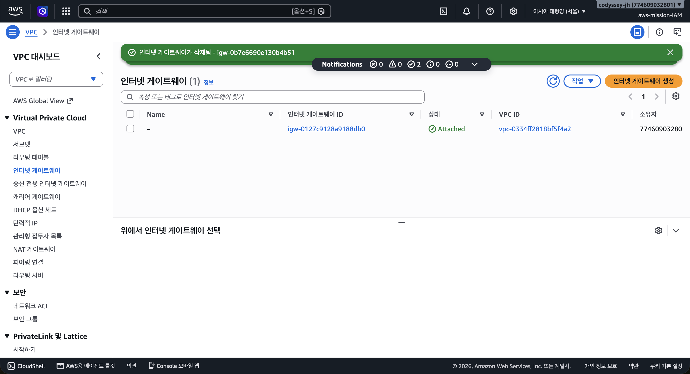
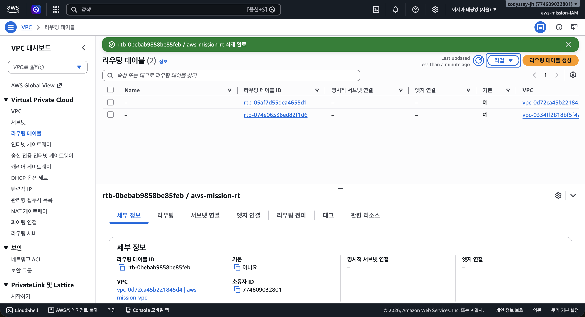
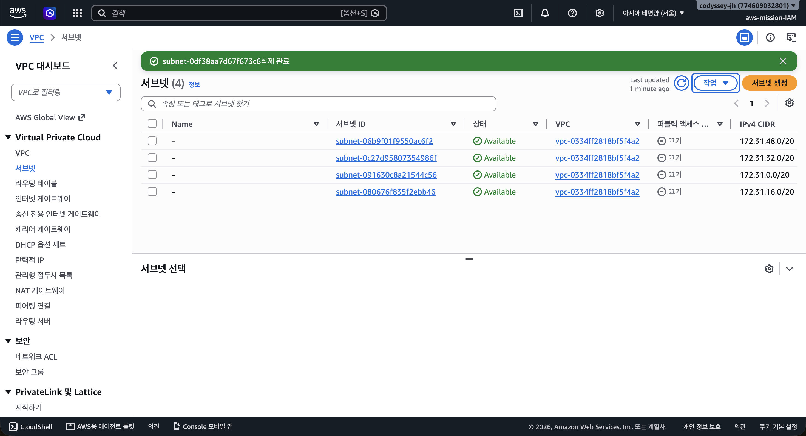
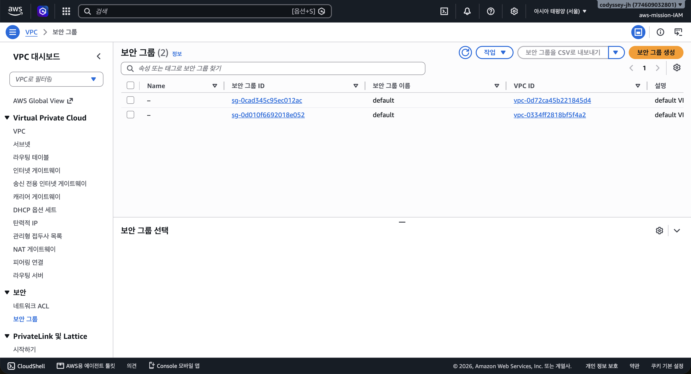
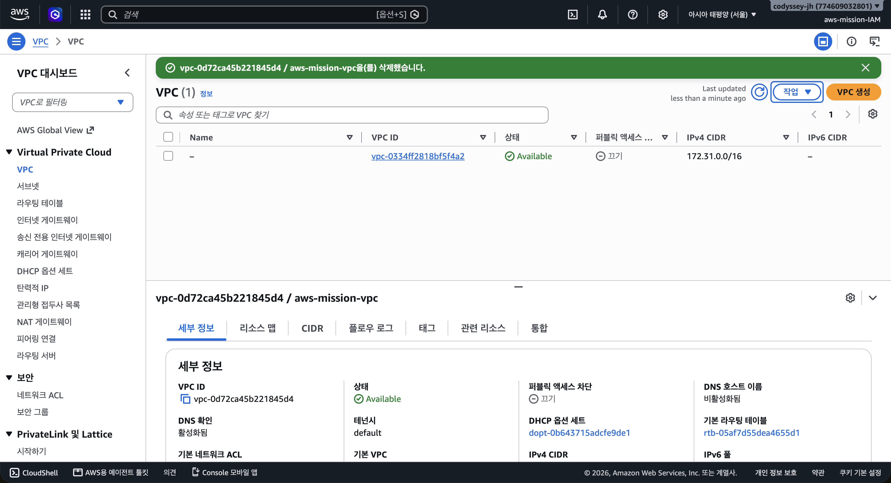

# 실습 리소스 정리 체크리스트

이 문서는 `docs/screenshots/cleanup/`의 화면을 기준으로 실습 리소스 정리 결과를 정리합니다. 대상 리전은 서울 `ap-northeast-2`이며, 삭제 완료 배너·목록 부재·종료 진행 상태를 구분해 기록했습니다. 전체 구성은 [README](../README.md)에서 확인할 수 있습니다.

## 1. 리소스별 결과

| 대상 | 실습 리소스 | 증거에서 확인한 결과 | 기록 상태 |
| --- | --- | --- | --- |
| EC2 | `aws-mission-ec2` / `i-054eeabf8b19481d9` | 종료 요청 처리 배너, 인스턴스 행은 `종료 중` | 종료 요청 확인; 최종 `terminated` 확인 필요 |
| EBS 볼륨 | 생성 설정은 `gp3`, `8 GiB`; 볼륨 ID 증거 없음 | 서울 리전 볼륨 목록에 “현재 이 리전에 볼륨이 없습니다” | 촬영 시점 볼륨 없음 확인 |
| Internet Gateway | `igw-0b7e6690e130b4b51` | 해당 ID 삭제 완료 배너 | 삭제 완료 확인 |
| 사용자 생성 Route Table | `aws-mission-rt` / `rtb-0bebab9858be85feb` | 해당 ID 및 이름 삭제 완료 배너 | 삭제 완료 확인 |
| Public Subnet | `subnet-0df38aa7d67f673c6` | 해당 ID 삭제 완료 배너 | 삭제 완료 확인 |
| 사용자 생성 Security Group | `aws-mission-sg` / `sg-04bf96b2f2a29e49a` | 삭제 후 목록에 `default` 그룹 2개만 표시 | 실습 그룹 목록 부재 확인 |
| VPC | `aws-mission-vpc` / `vpc-0d72ca45b221845d4` | 해당 ID 및 이름 삭제 완료 배너, 다른 VPC 1개만 남음 | 삭제 완료 확인 |
| Elastic IP | 생성·할당 여부를 확인할 화면 없음 | 전용 목록 또는 해제 결과 없음 | 할당 여부 및 잔여 할당 확인 필요 |
| NAT Gateway / ELB·ALB / RDS | 생성 여부를 확인할 화면 없음 | 이 프로젝트 구성에는 포함되지 않지만 계정 목록 증거 없음 | 미생성 또는 잔여 리소스 없음 확인 필요 |
| 키페어 / IAM 사용자·정책 / EBS 스냅샷 등 | 별도 정리 증거 없음 | 유지 또는 삭제 여부 확인 불가 | 실습 후 처리 상태 기록 필요 |

표의 결과는 제공된 촬영 시점의 기록입니다. 정리 화면 전체에 정확한 촬영 시각이 표시되지는 않으므로 모든 삭제 시각을 하나의 시간으로 임의 지정하지 않았습니다.

## 2. EC2 종료와 EBS 확인

### EC2: 종료 요청 처리 확인

녹색 배너에는 `i-054eeabf8b19481d9`의 종료 처리가 표시되지만, 목록과 상세 정보의 상태는 `종료 중`입니다. 따라서 이 화면만으로 최종 `terminated` 상태를 완료 처리하지 않았습니다. 퍼블릭·프라이빗 IPv4가 `-`로 표시되는 결과도 확인됩니다.

### EBS: 서울 리전 볼륨 없음 확인

볼륨 검색칸이 비어 있고, 서울 리전에서 “현재 이 리전에 볼륨이 없습니다”가 표시됩니다. 이는 촬영 시점의 리전 볼륨 목록이 비어 있음을 보여 줍니다. 실습 볼륨의 ID와 자동 삭제·수동 삭제 과정은 화면에 없으므로 삭제 방식까지 단정하지 않았습니다.

이 화면의 스냅샷 요약 `0 / 0`은 볼륨 백업 요약입니다. 별도 스냅샷 목록을 확인한 증거로 사용하지 않았습니다.

## 3. 네트워크 리소스 삭제 확인

### Internet Gateway

배너에 `igw-0b7e6690e130b4b51` 삭제 완료가 표시됩니다. 목록에 남아 있는 `igw-0127c9128a9188db0`은 다른 VPC에 연결된 리소스입니다. 실습 대상 게이트웨이가 삭제됐다는 결과와 계정의 모든 게이트웨이가 삭제됐다는 결과를 구분합니다. 분리 작업 자체의 화면은 제공되지 않았습니다.

### 사용자 생성 Route Table

배너에 `rtb-0bebab9858be85feb / aws-mission-rt` 삭제 완료가 표시됩니다. 이 시점에는 기본 Route Table 2개가 남아 있습니다. 사용자 생성 테이블 삭제가 확인되며, 실습 VPC의 기본 테이블이 이 화면에서 아직 남아 있다는 이유로 삭제 실패로 판단하지 않았습니다.

### Public Subnet

배너에 `subnet-0df38aa7d67f673c6` 삭제 완료가 표시됩니다. 남은 4개 Subnet은 다른 VPC `vpc-0334ff2818bf5f4a2`에 속해 있습니다.

### 사용자 생성 Security Group

목록에는 `default` 그룹 2개만 있으며, 실습 그룹 `aws-mission-sg`가 없습니다. 실습 그룹 ID와 EC2 연결은 [EC2 보안 그룹 화면](screenshots/ec2/ec2_after_sg.png)으로 대조할 수 있습니다. 삭제 완료 배너는 없으므로 이 증거는 목록에서 실습 그룹이 사라졌다는 범위로 기록했습니다.

### VPC

배너에 `vpc-0d72ca45b221845d4 / aws-mission-vpc` 삭제 완료가 표시됩니다. 새로고침된 목록에는 다른 VPC `vpc-0334ff2818bf5f4a2`만 남아 있습니다. 하단 상세 패널에 이전에 선택했던 실습 VPC 정보가 남아 있지만, 삭제 완료 배너와 상단 목록을 근거로 판단합니다.

## 4. 완료 여부 확인 목록

- [x] 실습 EC2의 종료 요청 처리를 확인했다.
- [ ] 실습 EC2의 최종 `terminated` 상태를 확인했다.
- [x] 서울 리전의 EBS 볼륨 목록이 비어 있음을 확인했다.
- [x] 실습 Internet Gateway 삭제 완료를 확인했다.
- [x] 실습 사용자 생성 Route Table 삭제 완료를 확인했다.
- [x] 실습 Public Subnet 삭제 완료를 확인했다.
- [x] 실습 Security Group이 목록에 없음을 확인했다.
- [x] 실습 VPC 삭제 완료를 확인했다.
- [ ] Elastic IP의 미할당 또는 해제 결과를 확인했다.
- [ ] NAT Gateway, ELB·ALB, RDS의 미생성 또는 정리 상태를 확인했다.
- [ ] 키페어, IAM 사용자·정책, 스냅샷 등 추가 리소스의 유지·삭제 상태를 기록했다.

리소스 정리 상태는 각 리소스의 목록과 상태를 기준으로 확인합니다. 리소스를 정리한 뒤에는 기존 실습 URL을 현재 서비스 주소로 사용하지 않습니다.
