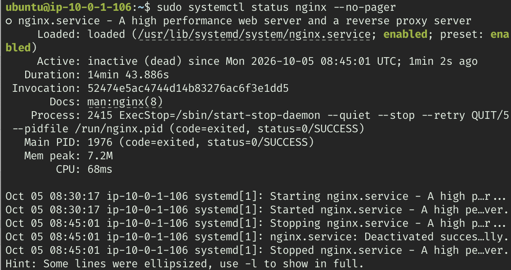
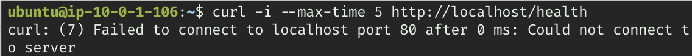
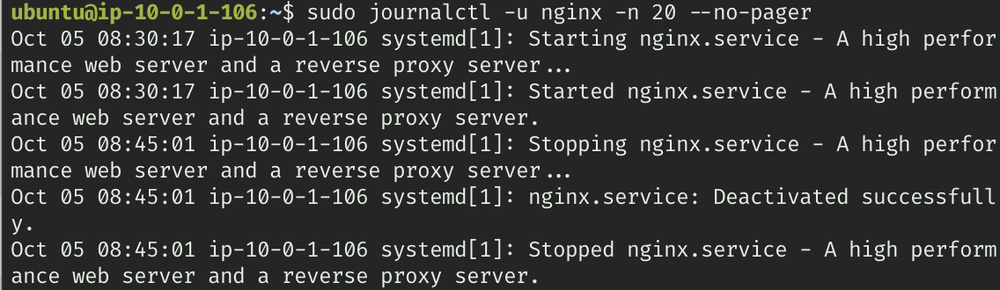

# Nginx 정지로 인한 HTTP 연결 실패 분석

이 문서는 실습 서버에서 Nginx가 정지한 상태를 확인하고 서비스를 다시 시작한 과정을 설명합니다. 첨부된 터미널 화면에서 확인되는 결과만 기록했습니다. 전체 구성은 [README](../README.md)에서 확인할 수 있습니다.

| 항목 | 확인 내용 |
| --- | --- |
| 대상 서버 | Ubuntu EC2, 프라이빗 IPv4 `10.0.1.106` |
| 확인 URL | `http://3.36.126.94/health`, `http://localhost/health` |
| Nginx 정지 시각 | 2026-10-05 17:45:01 KST (`08:45:01 UTC`) |
| Nginx 시작 시각 | 2026-10-05 17:48:24 KST (`08:48:24 UTC`) |
| 확인된 원인 | Nginx 서비스가 `inactive (dead)` 상태로 정지해 있었음 |
| 확인된 복구 결과 | `sudo systemctl start nginx` 이후 `active (running)` |
| 추가 확인 항목 | 정지를 실행한 주체·명령, 재시작 직후 HTTP 재검증 화면 |

## 1. Nginx 실행 상태 확인

서비스 상태를 확인한 화면에는 `Active: inactive (dead)`가 표시됩니다. `ExecStop`과 메인 프로세스는 `status=0/SUCCESS`로 종료됐고, systemd 기록에도 서비스 정지가 표시됩니다.

```bash
sudo systemctl status nginx --no-pager
```



이 결과는 Nginx가 실행 중이 아니었음을 보여 줍니다. 정지 명령을 실행한 화면은 없으므로 누가, 어떤 이유로 정지했는지 또는 의도적인 장애 재현이었는지는 확정하지 않습니다.

## 2. 공인 IP 요청의 연결 실패

공인 IP의 `/health`로 요청했을 때 `curl: (7) Failed to connect ... port 80`이 발생했습니다. HTTP 상태 코드를 받은 것이 아니라 서버의 80번 포트에 연결하지 못한 결과입니다.

```bash
curl -i --max-time 10 http://3.36.126.94/health
```


화면의 프롬프트는 `ubuntu@ip-10-0-1-106`입니다. 따라서 이 실패 증거는 **EC2 내부에서 공인 IP로 요청한 결과**입니다. 외부 PC의 브라우저 또는 터미널에서 발생한 실패를 직접 증명하는 화면은 아닙니다.

이 단계에서는 서비스 정지, 리스닝 포트 문제, 네트워크 설정 등을 원인 후보로 볼 수 있습니다. 공인 IP 요청 실패만으로 보안 그룹이나 라우팅 오류를 확정할 수는 없습니다.

## 3. localhost 요청으로 서버 내부 확인

같은 서버에서 `localhost`로 요청해도 80번 포트 연결이 실패했습니다.

```bash
curl -i --max-time 5 http://localhost/health
```



`localhost` 요청은 VPC의 인터넷 경로를 거치지 않습니다. 따라서 외부 경로를 수정하기 전에 서버 내부에서 HTTP 서비스를 제공하는 프로세스를 확인해야 합니다. 앞서 확인한 Nginx의 `inactive (dead)` 상태와 내부 연결 실패를 함께 보면 서비스 정지가 이 사례의 직접적인 원인이라는 판단을 뒷받침합니다.

## 4. 서비스 로그로 정지 기록 확인

최근 Nginx 서비스 로그를 조회해 상태 화면의 결과를 교차 확인했습니다.

```bash
sudo journalctl -u nginx -n 20 --no-pager
```



화면에는 다음 순서가 기록되어 있습니다.

| 시각 (KST) | 로그에서 확인한 동작 |
| --- | --- |
| 2026-10-05 17:30:17 | `Starting nginx.service`, `Started nginx.service` |
| 2026-10-05 17:45:01 | `Stopping nginx.service`, `Deactivated successfully`, `Stopped nginx.service` |

제공된 로그는 서비스가 정상적인 정지 절차를 거쳤음을 보여 줍니다. 오류로 비정상 종료됐다는 메시지는 이 화면에 없으며, 정지 요청의 주체까지 식별하는 로그는 첨부되지 않았습니다.

## 5. 서비스 시작과 복구 상태 확인

Nginx를 시작한 뒤 같은 서비스 상태 명령으로 확인했습니다.

```bash
sudo systemctl start nginx
sudo systemctl status nginx --no-pager
```


결과는 `active (running)`이며, 시작 과정의 `ExecStartPre`와 `ExecStart`가 `status=0/SUCCESS`로 표시됩니다. 시작 시각은 2026-10-05 17:48:24 KST입니다. 서비스 정지부터 재시작까지의 기록상 간격은 3분 23초입니다. 이 간격이 전체 사용자 영향 시간을 증명하는 것은 아닙니다.

현재 복구 화면은 **서비스 프로세스가 다시 실행된 결과**를 증명합니다. 재시작 직후 동일한 `/health` 요청이 `200 OK`를 반환했는지는 이 화면에 없으므로 아래 명령의 결과를 추가로 확보하면 HTTP 수준의 복구까지 확인할 수 있습니다.

```bash
# EC2 내부에서 확인
curl -i --max-time 5 http://localhost/health

# 외부 PC에서 확인
curl -i --max-time 10 http://3.36.126.94/health
```

위 명령은 후속 검증 절차이며, 실행 완료로 기록하지 않았습니다. 리소스 정리 후에는 이 실습 IP로 재검증할 수 없으므로 정리 전 확보한 화면을 기준으로 설명합니다.

## 6. 재발 방지

- 서비스 점검 시 `systemctl is-active nginx`, 내부 `/health`, 외부 `/health`를 순서대로 확인합니다. 프로세스 상태와 실제 HTTP 응답을 함께 확인할 수 있습니다.
- 설정을 변경할 때 `sudo nginx -t`로 설정을 확인한 뒤 변경을 적용하고, 적용 후 HTTP 요청을 재확인합니다.
- 서비스 정지 실습을 한다면 정지 명령·시각·복구 명령·복구 요청 결과를 함께 남깁니다.
- 첨부 상태 화면에는 서비스가 이미 `enabled`로 표시됩니다. 자동 시작 설정이 되어 있어도 실행 중인 서비스의 정지를 감지하고 복구하는 확인 절차는 별도로 필요합니다.
